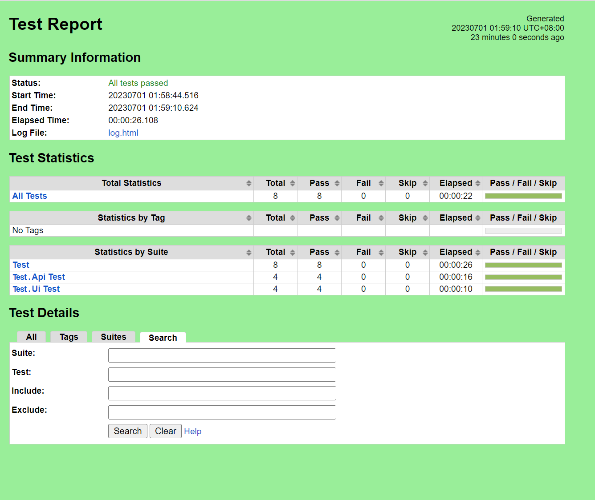
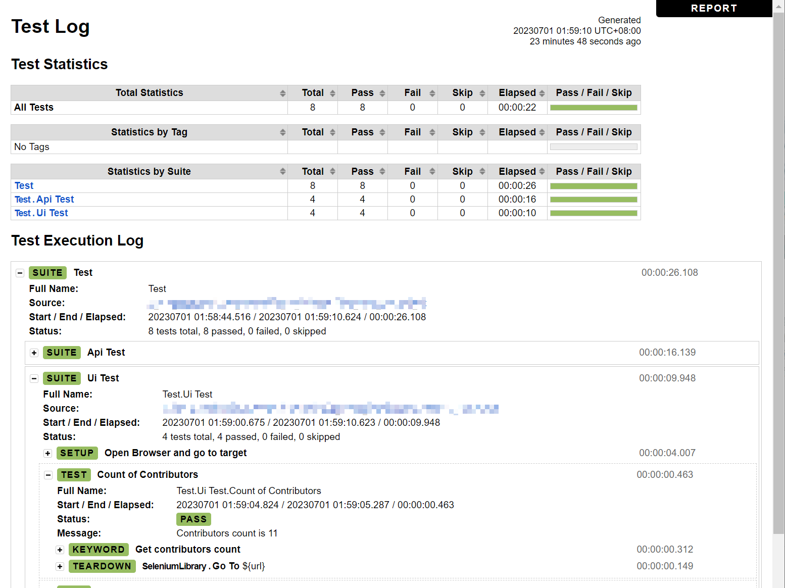

# Hahow Quality Engineer Recruitment
## Description
- Language: Python 3.9.7
- Test Framework: Robot Framework
- IDE: Visual Studio Code

## How to use?
1. Download [Python 3](https://www.python.org/downloads/)
2. Clone this Project.
3. Download [Chrome WebDriver](https://chromedriver.chromium.org/downloads), and put it in Dictionary (Please refer the structure below).
4. Install requirements.

        pip install -r requirements.txt  
5. Excute test.

        robot -d reports/ .\tests\

##  Dictionary structure
        ├── reports/                    # Test Report and Screen Shot Img
        ├── tests/                  
        │  ├── api_test.robot           # API test robot
        │  └── ui_test.robot            # UI test robot
        ├── locators/  
        │  └── ui_locator.robot         # UI Locator
        ├── chromedriver.exe            # WebDriver
        ├── .gitattributes
        ├── .gitignore
        ├── README.md
        └── requirements.txt 
## Report Demo
- Report.html

- Log.html

## Troubleshooting
- If you encounter the following error message, please change the Python command to "py" command.

        python: The term 'python' is not recognized as the name of a cmdlet, function, script file, or operable program.
        Check the spelling of the name, or if a path was included, verify that the path is correct and try again.
- If you encounter the following error message on a Mac OS environment, please refer to this [link](https://note.charlestw.com/macos-chromedriver-unidentified-developer/) for the solution.

        "chromedriver" cannot be opened because it is from an unidentified developer.
        macOS cannot verify that this app is free from malware.
        